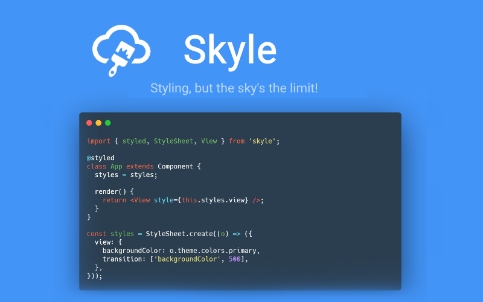

<p align="center">
  <a href="#"></a>
</p>

<p align='center'>
  An experimental <em>universal</em>, customizable styling and animation <br />
  library for <strong>React Native</strong>.
</p>
<br/>

<p align="center">
  <a href='#why'><strong>Why?</strong></a> ⎯
  <a href='#features'><strong>Features</strong></a> ⎯ 
  <a href='https://skyle.js.org'><strong>Website</strong></a> ⎯ 
  <a href='#documentation'><strong>Documentation</strong></a> ⎯ 
  <a href='#get-started'><strong>Get Started</strong></a> ⎯ 
  <a href='https://skyle.js.org/docs/examples/snack'><strong>Examples/Demos</strong></a> ⎯ 
  <a href='#contributing'><strong>Contributing!</strong></a>
</p>

<br/>

<p align="center">
  <a href="https://www.npmjs.com/package/skyle">
    
  </a>
  <a href="https://www.npmjs.com/package/skyle">
    
  </a>
  <a href="https://www.npmjs.com/package/skyle">
    
  </a>
  <a href="https://expo.io/@skylejs/skyle-example">
    
  </a>
</p>

<br/>

- 💡 Beautiful & Easy Syntax
- ⚡ Performant
- 🎨 Highly Customizable
- 🔼 **Expo** Compatible
- 🧩 Works on all Platforms! (**iOS**, **Android**, **Web**, **Windows**, **Mac**, etc.)
- 🌟 Supports **Media Queries**, **Theming**, **Transitions** and more!
- ☑️ Written in TypeScript

## Why?

_Skyle_ aims to provide styling utilities and to fill in the missing features that are available in CSS but not in React-Native. When switching between the two, the missing APIs become prominent. This is the main reason why this project was developed: Making styling a heck of a lot easier.

## Features

- ✔️ [Shorthands](#documentation)
- ✔️ [Length Units](#documentation)
- ✔️ [Theming](#documentation)
- ✔️ [Variables, State & Props](#documentation)
- ✔️ [Spread Props](#documentation)
- ✔️ [Media Queries](#documentation)
- ✔️ [Breakpoints](#documentation)
- ✔️ [Transitions](#documentation)
- ✔️ [Pseudo Classes & Elements](#documentation)
- ✔️ [Aliases](#documentation)
- ✔️ [Custom Preprocessors](#documentation)

and more!

#### [View all available properties](https://skyle.js.org/docs/properties)

---

## Get Started

### Installation

```bash
npm install skyle
# or
yarn add skyle
```

View more on the [Get Started](https://skyle.js.org/docs/get-started) documentation page.

---

## Documentation

View the official [Documentation](https://skyle.js.org/docs/get-started) on our site.

---

## Changelog

Please see [CHANGELOG.md](CHANGELOG.md)

---

## Contributing

Please read [CONTRIBUTING.md](CONTRIBUTING.md)

---

## ❤️ Inspiration

- [react-native-extended-stylesheet](https://github.com/vitalets/react-native-extended-stylesheet) by **vitalets**
- [react-native-animatable](https://github.com/oblador/react-native-animatable) by **oblador**
- [moti](https://github.com/nandorojo/moti) by **nandorojo**
- [react-native-stylex](https://github.com/retyui/react-native-stylex) by **retyui**

## License

[MIT](LICENSE)
